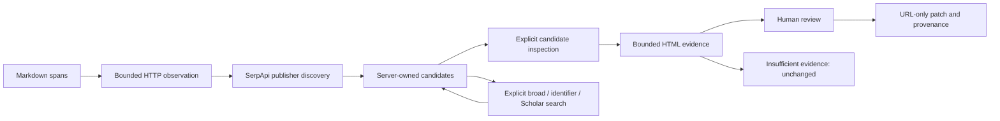

# SourcePatch V2 architecture

A local Python 3.11+ process serves three dependency-free browser assets. No runtime LLM, database, build pipeline, third-party page scripts or automatic approvals.

## Boundaries and limits

- `markdown.py` retains exact destination spans; no document serialization or in-place writes.
- `network.py` validates every URL, every DNS answer and each redirect; pins the validated public address, verifies TLS hostname/SNI, rejects credentials and non-default ports, and never forwards cookies or environment proxies. Provider requests forbid redirects.
- `evidence.py` uses that same `safe_get`, eight seconds, three redirects and 524,288 response bytes. HTMLParser never executes JavaScript. Up to 64,000 readable text characters, 256 nested tags, 12 headings of 120 characters, 4,096 anchors and three excerpts of at most 240 characters. Full HTML is discarded after extraction. Missing bytes, unreadable/unsupported content, failed retrievals and decoding loss are inconclusive. A missing fragment or mismatching/unobserved requested identifier prevents a related verdict.
- `engine.py` adds stable candidate IDs, four allowlisted strategies, discovery history, retained per-analysis observations and deterministic lexical scores. Extra searches require an explicit request. Up to eight search requests and twenty page-inspection attempts per analysis; at most twenty distinct candidates per citation. Duplicate ordinary inspection reuses its observation. Explicit bounded retry of no-response failures preserves the previous observation.
- `server.py` keeps eight analyses in memory. Analyze, discover, verify and export share one nonblocking gate; concurrent operations get 429. There is also a 64-inspection process cap. Existing provider limits remain one through eight attempted searches per process, counting failures and excluding successful cache hits.
- `web/app.js` uses textContent for every untrusted value. Source edits clear all decisions; evidence/discovery updates invalidate approval for that citation and all cached exports. In-flight export responses are guarded by analysis ID, decision snapshot and local revision. No cross-origin requests are made by the UI.

## API contracts

All writes require JSON, existing Host/Origin checks and a body of at most 800,000 bytes. The document limit is 200,000 characters and 60 distinct destinations.

| Route | Input | Result |
|---|---|---|
| GET `/api/config` | none | existing config plus V2 capability and page-inspection limits |
| POST `/api/analyze` | `{source}` | analysis including opaque `analysis_id`, candidate IDs, initial history |
| POST `/api/discover` | `{analysis_id, citation_id, strategy}` | updated stored analysis; strategy is publisher/broad/identifier/scholar |
| POST `/api/candidates/verify` | `{analysis_id, citation_id, candidate_id}` | updated stored analysis with evidence |
| POST `/api/export` | `{analysis_id, decisions}` | original server-source-based Markdown, diff, provenance |

New routes reject extra fields, including URL fields. IDs must belong to the stored analysis. Invalid input is 400; missing/evicted analyses 409; operation/process contention 429. Failed provider searches return an analysis containing a failure history entry, not fabricated results. Candidate HTTP/transport failure produces inconclusive evidence. Old export clients remain compatible: an uninspected explicit approval is accepted and labeled unverified. Once inspected, only a `related` candidate can be approved for export. A related verdict never automatically approves it. The legacy `page_verified` flag remains false; `page_inspected` separately records a direct HTTP observation.

## Relevance and ranking

Initial discovery retains the existing 45-point same-host signal, 40-point citation-title overlap and 15-point context overlap. Matching hosts are not verified publisher identities. Candidate inspection separately measures citation-topic overlap in readable body text, context overlap, page title and headings, bounded identifiers and anchors. URLs are removed from context comparisons. Heading/title matches alone cannot establish body relevance.

A related verdict requires body topic overlap >= 0.5, at least two topic tokens when available, context overlap >= 0.2, no requested identifier mismatch/absence, and a found or unrequested anchor. This is an explicitly limited lexical rule, not entailment or fact checking.

Inspected-related scores combine 35% of the original discovery score, 25 points body topic overlap, 15 context, 10 title, 10 headings, 3 matching identifier and 2 found anchor (bounded to 100). Non-related inspected candidates receive at most 25. Related candidates sort before uninspected candidates, then insufficient/inconclusive candidates; score and URL break ties. Close scores (gap <= 8) warn about ambiguity, preserving original ambiguity while candidates remain uninspected.

## Provider parameters and receipts

Google: `engine=google&q=...&hl=en&gl=in`. Scholar: `engine=google_scholar&q=...&hl=en`. Publisher search adds `site:`; broad removes scope; identifier search quotes recognized DOI/arXiv/numeric path identifiers. Scholar is explicitly selected and is suitable for academic labels. No pagination, async polling, paid retry, or engine substitution occurs.

Cache keys are sorted normalized parameter tuples including engine. Successful responses only are cached. Missing provider completion metadata is recorded as `not_supplied`, never invented as Success. Receipts allowlist engine, query, local timestamp, response hash, result count, cache use, HTTP status and optional validated search ID. Failed actual requests also retain sanitized receipts when a response exists. No raw response, key or credential-bearing URL is exported.

Official parameter references: [Google Search](https://serpapi.com/search-api), [Google Scholar](https://serpapi.com/google-scholar-api), [Account allowance](https://serpapi.com/account-api), checked October 8, 2026.

## Provenance

Source/output SHA256, search histories including failed/no-result attempts, candidate-specific discovery sources, retrieval metadata, response-content SHA256 (prefix only when truncated), bounded excerpts, anchor states, structured reasons, heuristic version, explicit decision marker and limitations are serialized. Skipped/unapproved inspected candidates retain their observations. `approved_by_user` is a legacy action marker, not authenticated human identity; the new approval object states `identity_authenticated: false`. Agent-operated demonstrations must disclose their operator separately.

## V2 review and retry contract

The V2 browser requires evidence state `related` before approval and sends `require_evidence: true` to `/api/export`; the server validates it as a boolean and rejects uninspected approvals. The legacy API default remains compatible and labels uninspected evidence honestly.

`/api/candidates/verify` accepts optional boolean `retry`. True requires an existing no-HTTP-response failure and fewer than three total attempts for the candidate. The server still resolves the stored candidate ID, checks its global budget and serializes the operation. The engine checks its per-analysis budget. Each explicit retry retains the previous observation in `evidence_history`, also exported for skipped candidates. Repeated ordinary requests reuse the current observation. No retry can override an observed insufficient page, blocked approval, URL membership or network policy.
